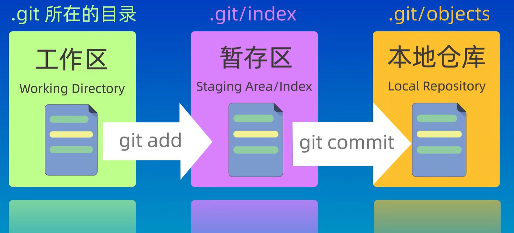
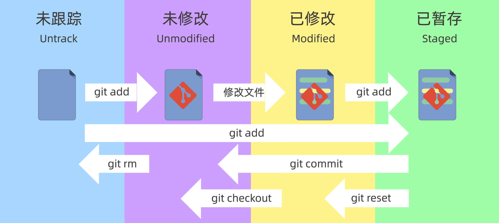
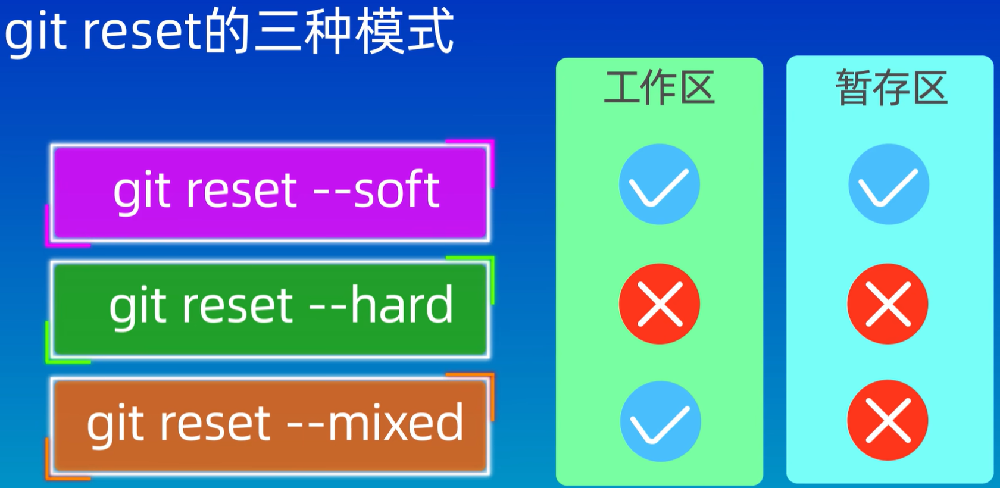
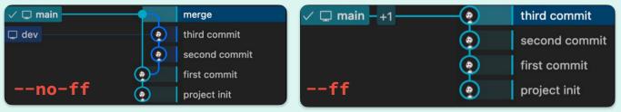
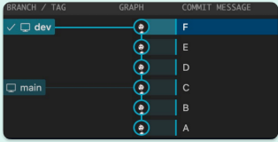

# Git学习

## B站学习教程

[【GeekHour】一小时Git教程_哔哩哔哩_bilibili](https://www.bilibili.com/video/BV1HM411377j?spm_id_from=333.788.videopod.sections&vd_source=e7b47e5f3fa453765428089d51a35829)

## 下载网址

[Git - Install for Windows](https://git-scm.com/install/windows)

## SSH配置和克隆仓库

远程地址的仓库有两种方式：**HTTPS**和**SSH**

**HTTPS**这种方式（https开头，GitHub在2018.08.13后停用了）在我们把本地代码push到远程仓库时需要验证用户名和密码

**SSH**这种方式（git开头）在推送的时候不需要验证用户名和密码，但需要在GitHub上添加SSH公钥的配置

```shell
git clone git@github.com:username/仓库名.git
# 报错提示我们要有正确的访问权限（因为没有配置SSH密钥导致）
# 先回到用户根目录 win11: win+R 输入cmd(当前的命令窗口就是用户根目录 C:\Users\用户名> )
# 执行以下指令自动创建所需的.ssh目录并生成密钥对
ssh-keygen -t ed25519 -C "your_email@example.com"
# 回车后提示输入密钥文件名称，第一次使用该命令直接回车即可，该命令会在.ssh目录下生成id_ed25519的密钥文件
# 若之前配置过ssh密钥这时最好不要回车，新的密钥会覆盖旧的密钥并且该操作不可逆，所以输入新的文件名回车输入密码即可
# 密钥生成操作就完成了
# 以上操作生成了两个新的文件id_ed25519(私钥文件，谁也别给)和id_ed25519.pub(公钥文件，复制文件内容上传到GitHub)
```

进入GitHub页面点击头像进入设置，页面左侧有个`SSH and GPG keys`选项，点击后，右侧有`New SSH key`的按钮，点击后，将公钥内容（后缀.pub文件）粘贴到下面的输入框中，标题输入任意一个名字，点击下方按钮`Add SSH key`，就成功将公钥添加到GitHub上了

注意：若第一次创建SSH密钥，且在创建密钥时也未修改过默认的文件名，按以上步骤即可，若指定了新的文件名，需增加一步配置

```shell
# 在.ssh文件夹中创建config文件（没有后缀名），如果已存在，直接编辑即可，将以下内容添加到文件里面
# 配置GitHub使用特定密钥
Host github.com
    HostName github.com
    User git
    PreferredAuthentications publickey
    IdentityFile ~/.ssh/你的自定义密钥文件名

```

**说明**：

- `Host github.com`：定义了一个主机别名，您之后可以使用 `ssh github.com`来测试连接，Git 也会自动识别这个配置。
- `User git`：连接 GitHub 必须使用 `git`用户。
- `IdentityFile`：**这是核心**，路径请指向您生成的那个**私钥**文件（不带 `.pub`后缀）。

**实践**

然后在执行将远程仓库克隆到本地的命令时，提示输入密码，也就是我们创建SSH密钥时指定输入的密码，之后即将远程仓库克隆到了本地，然后我们添加一个文件，添加到暂存区(git add .），提交(git commit -m "first commit")，查看仓库状态(git ls-files)发现仓库确实多了一个文件（但远程仓库还是空的），推送(git push)

**gitee的SSH的配置类似以上操作**

## 基本概念和特殊文件

| 名称        | 概念               |
| ----------- | ------------------ |
| main/master | 默认主分支         |
| origin      | 默认远程仓库       |
| HEAD        | 指向当前分支的指针 |
| HEAD^       | 上一个版本         |
| HEAD~4      | 上四个版本         |

| 文件名         | 说明                             |
| -------------- | -------------------------------- |
| .git           | Git仓库的元数据和对象数据库      |
| .gitignore     | 忽略文件，不需要提交到仓库的文件 |
| .gitattributes | 指向当前分支的指针               |
| .gitkeep       | 使空目录被提交到仓库             |
| .gitmodules    | 记录子模块的信息                 |
| .gitconfig     | 记录仓库的配置信息               |


## 初始化设置

```sh
# 配置用户名
git config --global user.name "Your Name" 

# 配置邮箱
git config --global user.email "mail@example.com"

# 存储配置
git config --global credential.helper store

# 查看Git的配置信息
git config --global --list
```

|    参数     |            表示            |
| :---------: | :------------------------: |
| 省略(Local) | 本地配置，只对本地仓库有效 |
|  --global   |   全局配置，所有仓库生效   |
|  --system   |  系统配置，对所有用户生效  |


## 创建仓库（版本库repository）

`git init` 或 `git clone`


## 区域和状态

| 区域                         | 解释                                                         |
| ---------------------------- | ------------------------------------------------------------ |
| 工作区 (Working Directory)   | 就是你在电脑里能实际看到的目录。                             |
| 暂存区 (Stage/Index)         | 暂存区也叫索引l，用来临时存放未提交的内容，一般在.git目录下的index中。 |
| 本地仓库 (Repository)        | Git在本地的版本库，仓库信息存储在.git这个隐藏目录中          |
| 远程仓库 (Remote Repository) | 托管在远程服务器上的仓库。常用的有GitHub、GitLab、Gitee等。  |




## 文件状态

- 已修改(Modified)
  修改了但是还没有保存到暂存区的文件。
- 已暂存(Staged)
  修改后已经保存到暂存区的文件。
- 已提交（committed)
  把暂存区的文件提交到本地仓库后的状态。

| 名称          | 状态         |
| ------------- | ------------ |
| ??(Untracked) | 未跟踪       |
| M(Modified)   | 已修改       |
| A(Added)      | 已添加暂存   |
| D(Deleted)    | 已删除       |
| R(Renamed)    | 重命名       |
| U(Updated)    | 已更新未合并 |





## 三种模式




## 查看状态或差异

```sh
# 查看Git版本
git -v

# 查看仓库状态，列出还未提交的新的或修改的文件。
git status

# 查看提交历史，--oneline表示简介模式。
git log --oneline

# 查看未暂存的文件更新了哪些部分。
git diff

# 查看两个提交之间的差异。
git diff <commit-id> <commit-id>
```


## 添加和提交

```sh
# 添加一个文件到暂存区，也可以使用git add . 就表示添加所有文件到暂存区。
git add <file>

# 提交所有暂存区的文件到本地仓库。
git commit -m "message"

# 提交所有已修改的文件到本地仓库。
git commit -am "message"

```


## 分支


```sh
# 查看所有本地分支，当前分支前面会有一个星号*，-r查看远程分支，-a查看所有分支。
git branch

# 创建一个新的分支。
git branch <branch-name>

# 切换到指定分支，并更新工作区。
git checkout -b <branch-name>

# 删除一个已经合并的分支。
git branch -d <branch-name>

# 删除一个分支，不管是否合并。
git checkout -D <branch-name>

# 给当前的提交打上标签，通常用于版本发布。
git tag <tag-name>

```

```sh
git merge --no-ff -m message <branch-name>
git merge --ff -m message <branch-name>
```

合并分支，--no-ff参数表示禁用FastForward模式，合并后的历史有分支，能看出曾经做过合并，而-ff参数表示使用FastForward模式，合并后的历史会变成一条直线。




```sh
# 合并&挤压（squash）所有提交到一个提交
git squash <branch-name>

# 查看远程分支
git branch -r

```


```sh
git checkout <dev>
git rebase <main>
```

**Rebase**操作可以把本地未push的分叉提交历史整理成直线，看起来更加直观。但是，如果多人协作时，不要对已经推送到远程
的分支执行rebase操作。
**Rebase**不会产生新的提交，而是把当前分支的每一个提交都“复制”到目标分支上，然后再把当前分支指向目标分支，而merge会
产生一个新的提交，这个提交有两个分支的所有修改。




## Stash

```sh
# Stash操作可以把当前工作现场“储藏”起来，等以后恢复现场后继续工作。
# -u参数表示把所有未跟踪的文件也一并存储；
# -a参数表示把所有未跟踪的文件和忽略的文件也一并存储；
# save参数表示存储的信息，可以不写。
git stash save "message"

# 查看所有 stash
git stash list

# 恢复最近一次stash
git stash pop

# 恢复指定的stash，stash@{2}表示第三个stash，stash@{0}表示最近的stash。
git stash pop stash@{2}

# 重新接受最近一次stash。
git stash apply

# pop和apply的区别是，pop会把 stash内容删除，而apply不会。可以使用gitstashdrop来删除stash。
git stash drop stash@{2}

# 删除所有stash。
git stash clear

```


## 远程仓库

```sh
# 添加远程仓库。
git remote addd <remote-name> <remote-url>

# 查看远程仓库。
git remote -v

# 删除远程仓库。
git remote rm <remote-name>

# 重命名远程仓库。
git remote rename <old-name> <new-name>

# 从远程仓库拉取代码。默认拉取远程仓库名origin的master或者main分支。
git pull <remote-name> <branch-name>

# 将本地改动的代码rebase到远程仓库的最新代码上（为了有一个干净、线性的提交历史)。
git pull --rebase

# 推送代码到远程仓库(然后再发起pull request)。
git push <remote-name> <branch-name>

# 获取所有远程分支。
git fetch <remote-name>

# Fetch某一个特定的远程分支。
git fetch <remote-name> <branch-name>
```

## 撤销和恢复

```sh
# 移动一个文件到新的位置。
git mv <file> <new-file>

# 从工作区和暂存区删除一个文件，并且将这次删除放入暂存区
git rm <file>

# 从索引/暂存区中删除文件，但是本地工作区文件还在，只是不希望这个文件被版本控制
git rm --cached <file>

# 恢复一个文件到之前的版本。
git checkout <file> <commit-id>

# 创建一个新的提交，用来撤销指定的提交，后者的所有变化将被前者抵消，并且应用到当前分支。
git revert <commit-id>

# 重置当前分支的HEAD为之前的某个提交，并且删除所有之后的提交。
# --hard参数表示重置工作区和暂存区，
# --soft参数表示重置暂存区，
# --mixed参数表示重置工作区。
git reset --mixed <commit-id>

# 撤销暂存区的文件，重新放回工作区(git add的反向操作)。
git restore --staged <file>
```


## GiFlow

**GitFlow**是一种流程模型，用于在Git上管理软件开发项目。
**主分支（master/main）**：代表了项目的稳定版本。每个提交到主分支的代码都应该是经过测试和审核的。
**开发分支（develop）**：用于日常开发。所有的功能分支、发布分支和修补分支都应该从开发分支派生出来。
**功能分支（feature）**：用于开发单独的功能或者特性。每个功能分支都应该从开发分支派生，并在开发完成后合并回开发分支。
**发布分支（release）**：用于准备项目发布。发布分支应该从开发分支派生，并在准备好发布版本后合并回主分支和开发分支。
**热修复分支（hotfix）**：用于修复主分支上的紧急问题。   热修复分支应该从主分支派生，并在修复完成后，合并回主分支和开发分支。