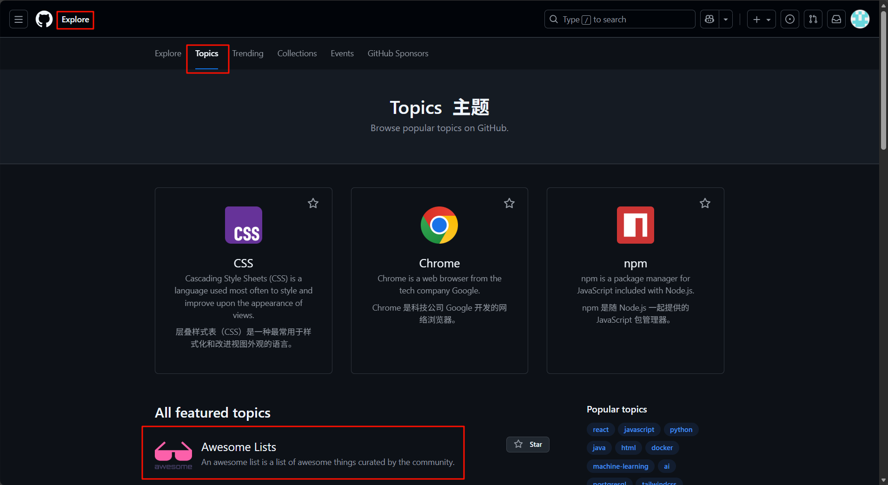

# GitHub使用

## 加速工具

Watt Toolkit

## 高效搜索资源

在github搜索关键词时，加上`awesome`提高搜索结果质量，原因是社区推动项目`Awesome Lists`

其他进入方式：

- 点击左上角的菜单三个横线，进入Explore探索页面，在探索页面下点击Topics就有Awesome Lists话题

​	

例：awesome english stars:>1000 收藏亮大于1000的英语资料

## 代码(code)搜索

| 搜索类型                   | 语法示例                          | 说明                                                       |
| -------------------------- | --------------------------------- | ---------------------------------------------------------- |
| 按名称、描述或README搜索   | in:name,description,readme spring | 查找名称、描述或README文件中包含"spring"的仓库。           |
| 按星标（stars）数量搜索    | stars:>1000 stars:10..50     | 查找星标超过1000的仓库。 查找星标在10到50之间的仓库。 |
| 按复刻（forks）数量搜索    | forks:>500                        | 查找复刻超过500次的仓库。                                  |
| 按编程语言搜索             | Language:python                   | 查找主要使用Python语言的仓库。                             |
| 按更新时间搜索             | pushed:>2025-01-01                | 查找在2025年1月1日之后有更新的仓库。                       |
| 按创建时间搜索             | created:<2024-01-01               | 查找在2024年1月1日之前创建的仓库。                         |
| 按所有者（用户或组织）搜索 | user:google或org:google           | 查找属于Google这个用户或组织的仓库。                       |
| 按主题（topic)搜索         | topic:machine-learning            | 查找包含"machine-learning"主题的仓库。                     |
| 按仓库大小搜索             | size:>=10000                      | 查找大小等于或大于10000KB（10MB）的仓库。                  |
| 使用“Awesome"关键词        | awesome-react                     | "Awesome"系列通常是某个领域优质资源的集合。                |
| 在特定仓库中搜索           | repo:user/repo-name"hello world"  | 在名为repo-name的仓库中搜索"helloworld"。                  |
| 按文件路径搜索             | path:/src/ "MyClass"              | 在路径包含/src/的文件中搜索"MyClass"。                     |
| 按文件扩展名搜索           | extension:js "const"              | 在所有 .js文件中搜索"const"。                              |
| 按文件名搜索               | filename:package.json             | 查找所有名为package.json的文件                             |
| 按文件大小搜索             | size:>50                          | 搜索大于50KB的代码文件                                     |
|                            |                                   |                                                            |

## 自由探索资源

- Explore探索 

- Topics话题 

- Trending趋势（最近爆火项目）

- Collections精选列表

- Events大新闻 

## 社区推荐 

**Hello Github**: 每月会总结当月GitHub的优质资源

**weekly**: 科技爱好者周刊

**libpku**: 北大课程资料（项目底部有其他高校资料）

**BiliBili公开课目录**: 搬运到B站的名校公开课

**Books-Free-Books**: 免费计算机书籍汇总

**design-resources-for-developers**: 大厂设计资源

**Awesome-Desin-Tools**: 设计工具

**程序员在家做饭方法指南**

**996icu**: 黑名单企业（未遵守劳动法）

**995**: 白名单企业

